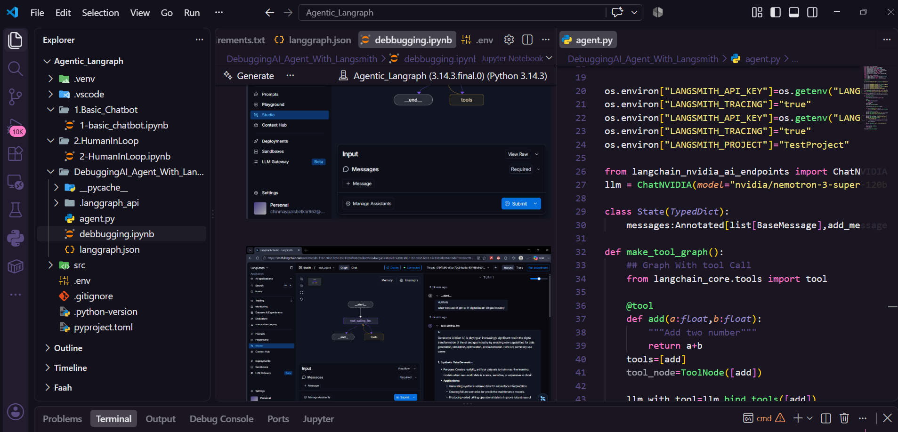

🤖 LangGraph & Agentic AI — Complete Bootcamp
Build, Debug, and Deploy Production-Ready AI Agents

Based on Krish Naik's Gen AI Bootcamp (Udemy — Section 30)

This repository documents the journey from basic chatbots to complex multi-agent systems — incorporating LangSmith for monitoring and LangGraph Studio for debugging. It's a hands-on companion to the bootcamp, taking you from stateless LLM calls to fully orchestrated, human-supervised, multi-agent pipelines.

📑 Table of Contents
Key Learning Outcomes
Quick Start Guide
Module Breakdown
Tech Stack & Tools
LangSmith Tracing & Studio Usage
Learning Path
Pro Tips
License
🎯 Key Learning Outcomes
#	Outcome	Description
1	Core Concepts	Understand the difference between stateless LLM calls and stateful LangGraph workflows
2	Agent Architectures	Build ReAct Agents with memory and chain-of-thought reasoning
3	Observability	Monitor agents, trace execution, and debug performance using LangSmith
4	Advanced Patterns	Implement Human-in-the-Loop approvals and Multi-Agent collaboration
5	Tooling	Set up development environments using uv and LangGraph Studio
6	Modern Integration	Connect external tools and data sources using MCP
🚀 Quick Start Guide
1️⃣ Environment Setup with uv

We use uv for fast, dependency-safe environments.

bash
# Install uv (if not installed)
curl -LsSf https://astral.sh/uv/install.sh | sh

# Clone the repository
git clone <repo-url>
cd langgraph-bootcamp

# Create and activate environment
uv venv --python 3.11
uv sync

# Install LangGraph dependencies
uv add langgraph langgraph-cli[inmem] langgraph-api langsmith
2️⃣ Run the Development Server

Use LangGraph Studio to visualize and debug your agents.

bash
# Start the local LangGraph server
langgraph dev

# Open Studio in your browser
# Navigate to http://localhost:5766
3️⃣ Run Specific Modules

Each module contains a main.py and its own instructions.

bash
# Example: Run the Basic Chatbot
cd 01_basics && python main.py

# Example: Run the ReAct Agent
cd 02_agent_architecture && python main.py
📖 Module Breakdown

 
<b>1. 🌱 Basics — Building the First Chatbot</b>
  
Concept: Introduction to StateGraph, nodes, and edges
Implementation: Create a simple sequential workflow where an LLM processes input and generates a response
Key Files: basic_chatbot.py, state_schema.py

 
 
<b>2. 🧠 AI Agent Theory & ReAct Architecture</b>
  
Concept: How agents think (Reasoning + Action)
Implementation: Build a ReAct Agent that can:
Plan steps (Reason)
Call tools (Act)
Observe results (Observe)
Key Files: react_agent.py, tools.py

 
 
<b>3. 🧩 Memory Implementation</b>
  
Concept: Maintaining context across conversations
Implementation:
Buffer Memory — store raw chat history
Summary Memory — summarize long conversations to save tokens
State Management — update the graph state dynamically
Key Files: memory_node.py, state_with_memory.py

 
 
<b>4. 🤝 Human-in-the-Loop</b>
  
Concept: Introducing human approval steps for critical actions
Implementation:
Create a node that pauses execution
Use conditional edges to route based on user input (Approve/Reject)
Implement interrupts for real-time feedback
Key Files: human_approval.py, interrupt_workflow.py

 
 
<b>5. 🔍 Monitoring & Debugging</b>
  
Concept: Observability is crucial for production agents
Implementation:
LangSmith — project setup, tracing runs, and evaluating performance
LangGraph Studio — visualizing the graph, inspecting state, and replaying traces
Key Files: monitoring_config.py, langsmith_tracing.py

 
 
<b>6. 🕸️ Multi-Agent Systems</b>
  
Concept: Collaborative agents working together
Implementation:
Graph of Graphs — sub-graphs for specific roles (e.g., Researcher, Writer, Editor)
Routing — dynamic routing between agents based on query type
Key Files: multi_agent_router.py, sub_graphs/

 
 
<b>7. 🔌 MCP (Model Context Protocol)</b>
  
Concept: Standardizing how LLMs connect to external data and tools
Implementation:
Connect to local files, databases, or APIs via MCP
Implement dynamic tool registration
Key Files: mcp_integration.py, mcp_tools/

🛠️ Tech Stack & Tools
Tool	Purpose
LangGraph	Framework for building stateful, multi-agent applications
LangSmith	Observability, tracing, and evaluation platform
LangGraph Studio	Local GUI for debugging and testing graphs
uv	Ultra-fast Python package manager and resolver
Pydantic	Data validation and state schema definition
OpenAI / Anthropic	LLM providers (configurable)
📊 LangSmith Tracing & Studio Usage
Visualizing the Agent
Start the server → langgraph dev
Open Studio → navigate to localhost:5766
Inspect state → click on nodes to see the state dump at that step
Debug → replay traces to see exactly where the agent failed
Key Metrics to Track
💰 Token Usage — monitor cost per run
⏱️ Latency — time taken for each node
⚠️ Error Rates — frequency of crashes or failed tool calls
🙋 Human Intervention — how often the Human-in-the-Loop is triggered
🤝 Contributing & Learning Path

This bootcamp is designed to be followed sequentially — each module builds on the previous one.

Start with 00_environment_setup to ensure your uv environment is clean
Follow the README in each folder for specific code instructions
Experiment — modify the code to add new tools or change the agent's personality
Deploy — once confident, deploy your graph to a cloud provider (AWS, Azure, or LangGraph Cloud)
💡 Pro Tips

Always use uv — it prevents dependency hell and ensures reproducible environments.

Check LangSmith — if an agent behaves unexpectedly, the trace will usually show the exact step where the reasoning failed.

Don't skip Human-in-the-Loop — it's critical for building trust in AI systems.

📝 License

This project is for educational purposes, based on Krish Naik's Udemy course. Feel free to fork and learn!

Happy Coding! 🚀

